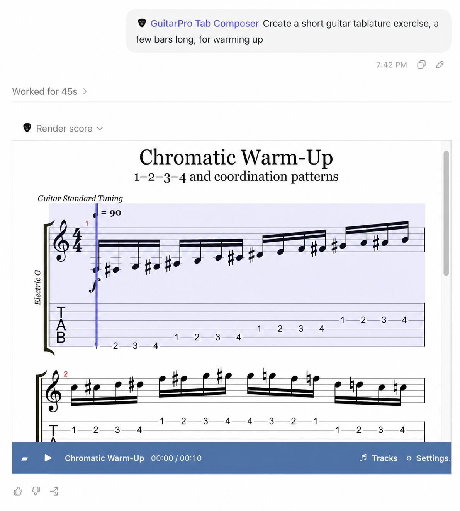

# GuitarPro Tab Composer

[](https://github.com/sgabenov/gpt-plugin-guitarpro-tab-composer/actions/workflows/ci.yml)
[](LICENSE)

GuitarPro Tab Composer is a local Codex plugin that turns natural-language music requests into validated, playable notation and guitar tablature. It combines an MCP server, a reusable Skill, and an inline [alphaTab](https://www.alphatab.net/) player.



## What it does

- Generates structured guitar and fretted-instrument scores from conversational requests.
- Validates rhythm, pitches, tuning, entity IDs, and cross-score references before storing a score.
- Renders standard notation and tablature inside the conversation.
- Plays scores with track, tempo, loop, metronome, mute, and solo controls.
- Imports Guitar Pro, MusicXML, and alphaTex files up to 5 MB.
- Exports Guitar Pro 7+, alphaTex, and SVG artifacts.
- Preserves immutable score versions across MCP and Codex restarts until the session expires.

## How it works

```text
Natural-language request
        |
        v
GuitarPro Tab Composer Skill
        |
        v
MusicScoreSpec v1 -> validation -> versioned score session
        |                              |
        v                              v
alphaTab renderer/player          GP / alphaTex / SVG
```

The model creates a `MusicScoreSpec` v1 document instead of writing a binary Guitar Pro file directly. The MCP server validates and stores the document, compiles it to alphaTex, generates persistent artifacts, and returns the final score to the inline player.

## Project status

The local MVP is complete and intended for a single local user. The repository includes the plugin manifest, MCP tools, MCP Apps UI, persistent expiring score storage, import/export support, vendored alphaTab browser assets, and automated tests.

Public marketplace deployment is not included. A public release would require a hosted HTTPS MCP endpoint, authentication or anonymous-session isolation, rate limiting, multi-user storage, and public privacy and terms pages. See [Security and privacy](docs/security-privacy.md).

## Requirements

- Node.js 20 or newer
- npm
- Python 3 for the plugin manifest validator
- Codex with local plugin support for the complete inline experience

## Quick start

```bash
git clone https://github.com/sgabenov/gpt-plugin-guitarpro-tab-composer.git
cd gpt-plugin-guitarpro-tab-composer
npm ci
npm run sync:assets
npm run check
```

Start the local Streamable HTTP MCP server and asset host:

```bash
npm run dev
```

The default endpoints are:

- MCP: `http://127.0.0.1:8787/mcp`
- standalone player preview: `http://127.0.0.1:8787/preview`

The preview route uses a deterministic fixture and is useful for checking notation, layout, alphaTab assets, and browser audio before testing the plugin host integration.

## Install as a local Codex plugin

The repository is structured as a Codex plugin: [`.codex-plugin/plugin.json`](.codex-plugin/plugin.json) describes the plugin and [`.mcp.json`](.mcp.json) launches the local stdio server.

Add the repository directory to a configured local marketplace, then install it with the marketplace name:

```bash
codex plugin add gpt-plugin-guitarpro-tab-composer@personal
```

After an update, reinstall the plugin and start a new Codex task so the refreshed Skill, MCP tools, UI, and static resources are loaded.

## Example prompts

- `Create an eight-bar Drop D metal riff at 140 BPM.`
- `Write a ten-bar chromatic warm-up for guitar.`
- `Create a four-bar fingerstyle study in 6/8 with a repeating bass line.`
- `Import this MusicXML score and show the guitar part.`
- `Change the final bar while preserving the existing score.`

Score creation opens the inline player as the complete response. GP, alphaTex, and SVG files are exposed only when the user explicitly requests an export or uses an export action in the player.

## Player controls

The inline component provides:

- play, pause, and stop;
- playback speed, count-in, loop, and metronome;
- track selection, mute, and solo;
- standard notation, tablature, or combined views;
- layout and scale settings;
- fullscreen requests;
- score import;
- explicit Guitar Pro and SVG export requests.

The player uses alphaTab's default master volume. A playback position can be selected directly in the rendered score.

## MCP tools

| Tool | Purpose |
| --- | --- |
| `validate_score` | Validate MusicScoreSpec without storing it. |
| `create_score` | Create version 1 of an expiring score session. |
| `get_score` | Retrieve the latest or an immutable historical version. |
| `update_score` | Append a version with optimistic concurrency control. |
| `compile_score` | Compile a stored version to deterministic alphaTex. |
| `render_score` | Open the stored score in the inline player. |
| `import_score` | Import supported Guitar Pro, MusicXML, or alphaTex content. |
| `export_score` | Return the GP, alphaTex, or SVG artifact for an exact version. |

The deterministic demo tools remain available for diagnostics and regression testing.

## Score sessions and artifacts

Sessions default to a one-hour TTL. Callers can select a TTL from 60 seconds to 24 hours. Updates preserve the original expiry and append immutable versions rather than replacing previous data.

The default data directory is:

```text
$XDG_DATA_HOME/guitarpro-tab-composer
```

or, when `XDG_DATA_HOME` is not set:

```text
~/.local/share/guitarpro-tab-composer
```

Set `GUITARPRO_TAB_DATA_DIR` and `GUITARPRO_TAB_ARTIFACT_DIR` to override score and artifact locations.

## Vendored alphaTab resources

The browser runtime does not depend on a public CDN. The pinned alphaTab 1.8.4 runtime, worker, worklet, Bravura fonts, Sonivox SoundFont, upstream licenses, and SHA-256 manifest live under [`vendor/alphatab/1.8.4`](vendor/alphatab/1.8.4/).

After changing the alphaTab dependency, refresh and verify the vendored files:

```bash
npm run sync:assets
npm run check
```

For an HTTPS deployment, set `ASSET_BASE_URL` to the public asset origin used by the iframe CSP.

## Build and package

Build the UI and server:

```bash
npm run build
```

Create an npm-compatible release archive:

```bash
npm run package:plugin
```

The archive is written to `artifacts/gpt-plugin-guitarpro-tab-composer-<version>.tgz`. The packaging command builds the project and verifies that the manifest, MCP configuration, Skill, compiled server/UI, launcher, icons, and vendored alphaTab runtime are present.

This archive is intended as a GitHub release or local distribution artifact; the package remains private and is not configured for publication to the npm registry. After extracting it, run `npm install --omit=dev` before registering its directory in a Codex marketplace.

## Development commands

| Command | Description |
| --- | --- |
| `npm run dev` | Watch and run the HTTP MCP server. |
| `npm run start:stdio` | Run the stdio transport used by the local plugin. |
| `npm run lint` | Check repository formatting and generated-file rules. |
| `npm run typecheck` | Type-check the UI and server. |
| `npm test` | Run the complete Vitest suite. |
| `npm run test:ui` | Run focused production UI tests. |
| `npm run schema:check` | Verify the generated JSON Schema. |
| `npm run validate:plugin` | Validate the local plugin manifest. |
| `npm run package:check` | Dry-run package creation and verify required contents. |
| `npm run check` | Run the complete local verification pipeline. |

## Documentation

- [MusicScoreSpec v1](docs/music-score-spec-v1.md)
- [alphaTab compatibility matrix](docs/alphatab-compatibility-matrix.md)
- [Runtime constraints](docs/phase-0-runtime-constraints.md)
- [Rendering and playback spike](docs/phase-0-rendering-playback-spike.md)
- [Security and privacy](docs/security-privacy.md)
- [Generated JSON Schema](schemas/music-score-spec-v1.schema.json)

## Current limitations

- The server is designed for a single local user and has no authentication or multi-user isolation.
- Sessions expire after their selected TTL and are removed lazily when accessed.
- Import preserves the supported MusicScoreSpec subset; unsupported source features are reported or rejected.
- The score contract focuses on pitched fretted instruments. Advanced layout, lyrics, percussion, and exhaustive Guitar Pro techniques are outside the current MVP.
- Browser audio still requires a user gesture, so playback cannot start automatically.

## Repository policy

All source code, identifiers, documentation, issues, pull requests, commit messages, and developer-facing output must be written in English.

## License

Project code is released under the [MIT License](LICENSE). Bundled alphaTab, Bravura, and SoundFont assets retain their upstream licenses under [`vendor/alphatab/1.8.4`](vendor/alphatab/1.8.4/).

## References

- [OpenAI plugin architecture](https://developers.openai.com/plugins/concepts/plugins)
- [OpenAI MCP server guide](https://developers.openai.com/plugins/build/mcp-server)
- [OpenAI MCP Apps UI guide](https://developers.openai.com/plugins/build/chatgpt-ui)
- [alphaTab documentation](https://www.alphatab.net/docs/introduction)
